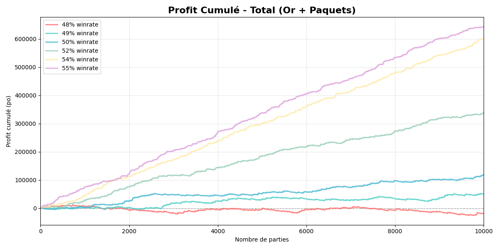
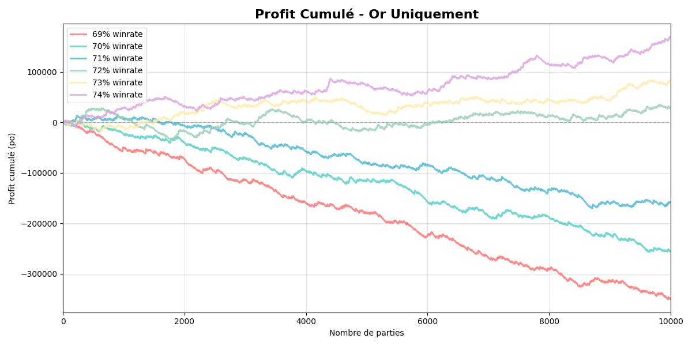

# Rapport d'analyse de rentabilité de l'arène underground

## Contexte et hypothèses

L'étude vise à évaluer la rentabilité de l'arène underground en fonction du nombre de victoires et du taux de réussite (winrate).

Les gains dans l'arène se décomposent en deux catégories :

- **Récompenses en or** selon le nombre de victoires (1 ticket d'admission = 150po) :
  - 0 ou 1 victoire : 0 or
  - 2 victoires : 30 or
  - 3 victoires : 45 or
  - 4 victoires : 95 or
  - 5 et 6 victoires : 150 or
  - De 7 à 12 victoires : 300 or

- **Récompense possible de 2000 or** supplémentaire (la faveur de la foule) avec une probabilité :
  - 6 victoires : 5%
  - 7 victoires : 6%
  - 8 victoires : 7%
  - 9 victoires : 8%
  - 10 victoires : 9%
  - 11 victoires : 10%
  - 12-2 : 11%
  - 12-1 : 12%
  - 12-0 : 13%

- **Récompenses en paquets (=100 gold)** selon le nombre de victoires (je sais que ce ne sont pas nécessairement des récompenses fixes, mais c'est un choix d'étude) :
  - De 0 à 5 victoires : 2 paquets
  - 6 à 7 victoires : 3 paquets
  - 8 victoires : 4 paquets
  - 9 à 11 victoires : 5 paquets
  - 12 victoires : le nombre de paquets varie selon le nombre de défaites :
    - 12-0 : 8 paquets
    - 12-1 : 7 paquets
    - 12-2 ou plus : 6 paquets

## Analyse de rentabilité

- En combinant la valeur totale des récompenses (or + valeur estimée des paquets), **l'arène underground devient rentable dès un taux de victoires d'environ 49%**.

- Si l'on considère uniquement le gain en or, et qu'on souhaite jouer sans jamais dépenser d'argent, le taux de victoire minimal nécessaire pour être rentable se situe autour de **72%**.

